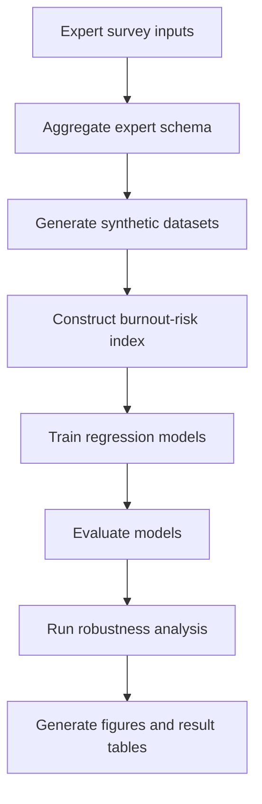

# Capstone_Shahaf_Brenner
Proof-of-concept ML pipeline for AI-driven early burnout risk detection from employee digital work patterns. Uses expert elicitation, synthetic data generation, comparative model evaluation, and robustness analysis to test the computational feasibility of approximating early burnout risk under controlled conditions.


## Executive summary
This repository contains the full code implementation for my bachelor thesis:
**Thesis:** AI-Driven Early Burnout Risk Detection from Digital Work Patterns for Proactive Workforce Optimization  
**Author:** Shahaf Brenner  
**Institution / Program:** IE University, School of Science & Technology / BCSAI
**Supervisor(s):** Prof. Antonio Zabaleta Moreno  


This repository implements the full end-to-end research pipeline described in the thesis, including:
- expert survey aggregation
- feature schema construction
- synthetic dataset generation
- model training and evaluation
- robustness and circularity checks
- result artifact generation for tables and figures


The goal of this project is **not** to claim real-world burnout detection from real employee data. Instead, it provides a **computational proof of concept** showing that expert-defined early burnout-risk logic can be translated into quantitative digital indicators and approximated by machine-learning models in an uncertainty-aware synthetic environment.

If you use this repository in academic work, please cite it using the information in `CITATION.cff`.

---
## Research question

> To what extent can AI identify early burnout risk patterns in employee digital behavior that enable proactive workforce optimization?

---
## What this project does

Burnout is usually detected late, after symptoms or performance decline have already become visible. This project explores whether **early burnout-risk logic** can be modeled from **digital work metadata patterns** such as:
- night work
- after-hours communication
- weekend activity
- backlog size
- long workdays
- break frequency
- context switching
- meeting density
- sick leave frequency
- notification load

The repository implements a controlled ML pipeline that:
1. aggregates expert survey responses into a formal feature schema  
2. generates synthetic employee monthly digital work profiles  
3. constructs a continuous burnout-risk index from expert-defined rules  
4. compares multiple regression models  
5. tests robustness under alternative synthetic-data assumptions  

---

## Key thesis findings implemented in this repository

According to the thesis, the final proof-of-concept setup used:
- **8 domain experts**
- **20 retained digital-work features**
- **2 synthetic datasets**:
  - small PoC dataset: 1,000 observations
  - full dataset: 5,000 observations
- **5 regression models**:
  - OLS
  - Ridge
  - Lasso
  - Random Forest
  - Gradient Boosting

The thesis reports that **Gradient Boosting** achieved the best overall performance on the synthetic target and remained the strongest model across robustness scenarios. This should be interpreted as evidence of **computational feasibility**, not real-world predictive validity.

---


## Repository structure

```text
┌── data/
│   ├── DB/  
│   │   ├── baseline/
│   │   │   ├── scenario_metadata.json
│   │   │   ├── synthetic_full_5000.csv
│   │   │   └── synthetic_small_1000.csv  (Small_PoC_database)
│   │   ├── alpha_minus_10/
│   │   ├── alpha_plus_10/
│   │   ├── drop_After_hours_communication/
│   │   ├── drop_Break_frequency/
│   │   ├── drop_Task_completion/
│   │   ├── drop_Work_time_VS_clock_in_out/
│   │   ├── high_noise/
│   │   ├── low_noise/
│   │   ├── no_correlation/
│   │   └── weight_resample_*/ (01 to 05)
│   │
│   ├── Expert_Aggregated_DB/
│   │   ├── aggregated_feature_schema.csv
│   │   └── alpha_value.txt
│   │
│   └── split_by_stable_keys/  
│       ├── Direction.xlsx
│       ├── Frequency.xlsx
│       ├── Green_Zone.xlsx
│       ├── Importance.xlsx
│       └── Red_Zone.xlsx
|
├── results/
│   ├── linear/
│   │   ├── OLS_c817e152/
|   |   |   ├── cv_fold_indices.json
|   |   |   ├── cv_results.csv
|   |   |   ├── feature_importance.csv
|   |   |   ├── run_config.json
|   |   |   ├── test_metrics.json
|   |   |   └── test_predictions.csv
│   │   └── runs_summary.csv
|   |
│   ├── regularized/
│   │   ├── Lasso_78d11b6f/   (same files as OLS exmple)
│   │   ├── Ridge_492572bf/   (same files as OLS exmple)
│   │   └── runs_summary.csv
|   |
│   └── tree/
│       ├── GradientBoosting_35fbf139/ (same files as OLS exmple)
│       ├── RandomForest_aeaeb022/     (same files as OLS exmple)
│       └── runs_summary.csv
|
├── src/
│   ├── pipelines/
│   |   ├── __init__.py
│   |   ├── plot_cv_results.py
│   |   ├── run_final_analysis.py
│   |   ├── db/
│   |   |   ├── __init__.py
│   |   |   ├── Expert_DB_aggregation.py
│   |   |   ├── run_generate_all_circularity_dbs.py
│   |   |   ├── run_generate_baseline_db.py
│   |   |   └── circularity_individual_db/  (individual scripts for each circularity test db generation)
|   |   |
│   |   ├── ml_models/
│   |   |   ├── __init__.py
│   |   |   ├── run_linear_models.py
│   |   |   ├── run_regularized_models.py
│   |   |   └── run_tree_models.py
|   |   |
│   |   └── robustness_analysis/
│   |       ├── __init__.py
│   |       └── run_validation_all_circularity_dbs.py
|   |
│   ├── synthetic_db/
│   |   ├── __init__.py
│   |   ├── synthetic_config.py
│   |   ├── synthetic_generator.py
│   |   ├── synthetic_risk.py
│   |   ├── synthetic_sampling.py
│   |   ├── synthetic_scenarios.py
│   |   └── synthetic_schema.py
|   |
│   └── thesis_ml/
│       ├── __init__.py
│       ├── config.py
│       ├── data.py
│       ├── final_analysis.py
│       ├── metrics.py
│       ├── model_builders.py
│       ├── preprocess.py
│       ├── results.py
│       ├── training.py
│       ├── validation_runner.py
│       └── visualization.py
|   
├── validation_results/
│   ├── alpha_minus_10/
│   |   ├── linear/  
│   │   |   ├── OLS_XXXXXXXX/    (XXXXXXXX = model run ID)
│   |   │   |   ├── cv_fold_indices.json
│   |   │   |   ├── cv_results.csv
│   |   │   |   ├── feature_importance.csv
│   |   │   |   ├── run_config.json
│   |   │   |   ├── test_metrics.json
│   |   │   |   └── test_predictions.csv
│   |   │   └── runs_summary.csv
|   │   |
│   |   ├── regularized/
│   │   |   ├── Lasso_XXXXXXXX/  (same files as OLS exmple)
│   │   |   ├── Ridge_XXXXXXXX/  (same files as OLS exmple)
│   |   │   └── runs_summary.csv
│   |   │   
│   |   └── tree/
│   │       ├── GradientBoosting_XXXXXXXX/  (same files as OLS exmple)
│   │       ├── RandomForest_XXXXXXXX/      (same files as OLS exmple)
│   |       └── runs_summary.csv
|   |
│   └── etc. (1 folder for each circularity test model results)
├── README.md
├── LICENSE
├── CITATION.cff
├── requirements.txt
└── .gitignore
```
---
## Data & inputs
1. **Expert survey files -** These files contain the structured expert responses used to define feature importance, frequency, directionality, and risk ranges:
    - **Dataset name:** Importance.xlsx, Frequency.xlsx, Direction.xlsx, Green_Zone.xlsx, Red_Zone.xlsx.
    - **Type:** primary / original survey datasets.
    - **Where it comes from:** Expert survey results.
    - **File(s) path:** [`data/split_by_stable_keys/`](data/split_by_stable_keys/)

2. **Aggregated expert schema -** This file contains the aggregated feature-level parameters derived from the expert surveys:
    - **Dataset name:** aggregated_feature_schema.csv.
    - **Type:** primary / survey dataset.
    - **Where it comes from:** processed expert knowledge base.
    - **File(s) path:** [`data/Expert_Aggregated_DB/aggregated_feature_schema.csv`](data/Expert_Aggregated_DB/aggregated_feature_schema.csv)

3. **Baseline synthetic dataset -** This is the main synthetic dataset generated from the expert schema and used for training and evaluation:
    - **Dataset name:** Baseline synthetic_full_5000.csv.
    - **Type:** Synthetic.
    - **Where it comes from:** Generated as specifide in the methodology using aggregated_feature_schema.csv as base.
    - **File(s) path:** [`data/DB/baseline/synthetic_full_5000.csv`](data/DB/baseline/synthetic_full_5000.csv)

4.  **Robustness-analysis datasets -** Alternative synthetic datasets created under modified assumptions such as higher noise, lower noise, no correlation, alpha perturbations, feature removal, and repeated weight resampling:
    - **Dataset name:** Robustness analysis DBs.
    - **Type:** Synthetic.
    - **Where it comes from:** Generated as specifide in the methodology using aggregated_feature_schema.csv as base (alterntive synthetic generation parameters).
    - **File(s) path:** 
        - [`alpha_minus_10`](data/DB/alpha_minus_10/)
        - [`alpha_plus_10`](data/DB/alpha_plus_10/)
        - [`drop_After_hours_communication`](data/DB/drop_After_hours_communication/)
        - [`drop_Break_frequency`](data/DB/drop_Break_frequency/)
        - [`drop_Task_completion`](data/DB/drop_Task_completion/)
        - [`drop_Work_time_VS_clock_in_out`](data/DB/drop_Work_time_VS_clock_in_out/)
        - [`high_noise`](data/DB/high_noise/)
        - [`low_noise`](data/DB/low_noise/)
        - [`no_correlation`](data/DB/no_correlation/)
        - [`weight_resample_01`](data/DB/weight_resample_01/)
        - [`weight_resample_02`](data/DB/weight_resample_02/)
        - [`weight_resample_03`](data/DB/weight_resample_03/)
        - [`weight_resample_04`](data/DB/weight_resample_04/)
        - [`weight_resample_05`](data/DB/weight_resample_05/)
        - [`Small_PoC_database`](data/DB/baseline/synthetic_small_1000.csv)

---

## Privacy, scope, and ethics

This repository does **not** use real employee monitoring data.

Important scope notes:

- the project is based on **synthetic employee metadata**
- it models **digital work metadata**, not message content or private communications
- it is a **research proof of concept**, not a deployment-ready monitoring system
- the output should be interpreted as **early-risk approximation under synthetic conditions**, not diagnosis
- any real-world extension would require careful handling of privacy, consent, fairness, transparency, and human oversight

---
## Method overview

### Expert-informed risk modeling
Experts were surveyed to evaluate potential burnout-related digital indicators along dimensions such as:
- importance
- frequency
- directionality
- green-zone values
- red-zone values

These responses were aggregated into a formalized feature schema.

### Synthetic data generation
The project generates monthly employee digital metadata profiles using:
- truncated normal sampling for behavioral features
- uniform sampling for structural features
- weak intra-category correlation structures
- sampled expert-weight uncertainty
- additive Gaussian noise

### Continuous burnout-risk target
The dependent variable is a continuous burnout-risk score on a 0–100 scale, constructed from expert-informed additive risk logic.

### Comparative modeling
The project compares multiple regression model families:
- OLS
- Ridge
- Lasso
- Random Forest
- Gradient Boosting

### Evaluation
Performance is assessed using:
- RMSE
- MAE
- R²
- cross-validation
- held-out test evaluation
- residual diagnostics
- robustness analysis

---

## Pipeline overview


---
## Installation

### Requirements

- Python 3.10 --> **3.11.9 (Recomended)**
- pip
- packages listed in `requirements.txt`

### Clone the repository

```bash
git clone https://github.com/shahafbr/Capstone_Shahaf_Brenner.git
cd Capstone_Shahaf_Brenner
```

### Create and activate a virtual environment

**Windows (PowerShell)**

```bash
python -m venv .venv
.venv\Scripts\Activate.ps1
```

**macOS / Linux**

```bash
python -m venv .venv
source .venv/bin/activate
```

### Install dependencies

```bash
pip install --upgrade pip
pip install -r requirements.txt
```

---

## How to run the project

### 1. Aggregate expert survey outputs

```bash
python -m src.pipelines.db.Expert_DB_aggregation
```

### 2. Generate the baseline synthetic database

```bash
python -m src.pipelines.db.run_generate_baseline_db
```

### 3. Generate all robustness / circularity test databases

```bash
python -m src.pipelines.db.run_generate_all_circularity_dbs
```

### 4. Run the main model families

Linear models:

```bash
python -m src.pipelines.ml_models.run_linear_models
```

Regularized models:

```bash
python -m src.pipelines.ml_models.run_regularized_models
```

Tree-based models:

```bash
python -m src.pipelines.ml_models.run_tree_models
```

### 5. Run final analysis and result generation

```bash
python -m src.pipelines.run_final_analysis
```

### 6. Run validation on all robustness datasets

```bash
python -m src.pipelines.robustness_analysis.run_validation_all_circularity_dbs
```

### 7. Plot cross-validation results

```bash
python -m src.pipelines.plot_cv_results
```
---

## Reproducing the thesis workflow

A typical full reproduction flow is:

```bash
python -m src.pipelines.db.Expert_DB_aggregation
python -m src.pipelines.db.run_generate_baseline_db
python -m src.pipelines.db.run_generate_all_circularity_dbs
python -m src.pipelines.ml_models.run_linear_models
python -m src.pipelines.ml_models.run_regularized_models
python -m src.pipelines.ml_models.run_tree_models
python -m src.pipelines.run_final_analysis
python -m src.pipelines.robustness_analysis.run_validation_all_circularity_dbs
python -m src.pipelines.plot_cv_results
```

---

## Output artifacts

### Main training results
Stored under:

- `results/linear/`
- `results/regularized/`
- `results/tree/`

Each model run directory typically contains:

- `cv_fold_indices.json`
- `cv_results.csv`
- `feature_importance.csv`
- `run_config.json`
- `test_metrics.json`
- `test_predictions.csv`

### Validation / robustness results
Stored under:

- `validation_results/<scenario_name>/...`

### Figures and analysis outputs
Generated by the analysis and plotting scripts and used in the thesis results section.

---

## Main robustness scenarios

The repository includes structured robustness checks for:

- no correlation
- low noise
- high noise
- alpha +10%
- alpha -10%
- feature removal
- repeated weight resampling
- smaller dataset size

These tests are meant to evaluate whether the main conclusions remain stable when the synthetic generation assumptions are changed.

---

## Interpreting the results correctly

This repository does **not** prove that burnout can already be detected from real employee metadata in production systems.

What it **does** show is that:

- expert-defined burnout-risk logic can be formalized
- synthetic digital-work indicators can be generated from that logic
- ML models can approximate that synthetic target
- tree-based ensemble models appear better suited than linear models in this controlled setup

This repository should therefore be understood as a **methodological and computational proof of concept**.

---

## Limitations

Key limitations of this implementation include:

- the entire framework depends on synthetic data
- the target variable is expert-constructed, not empirically observed
- the expert sample is intentionally small and purposive
- burnout is simplified into a structured additive risk process
- no real-world legal, organizational, or deployment validation is performed here

---

## Citation

This repository includes a `CITATION.cff` file so the project can be cited properly.

If you use this work, please cite both:

1. the repository
2. the thesis itself, where relevant

Example software citation format:

```bibtex
@software{brenner_capstone_burnout_detection,
  author  = {Shahaf Brenner},
  title   = {Capstone Shahaf Brenner: AI-Driven Early Burnout Risk Detection from Digital Work Patterns},
  year    = {2026},
  url     = {<your-repository-url>}
}
```

---

## License

This repository is released under the license provided in `LICENSE`.

---

## Acknowledgments

- **Shahaf Brenner**
- **Prof. Antonio Zabaleta Moreno**
- IE University, School of Science & Technology

---

## Contact

For academic or project-related questions, please open an issue in the repository.
